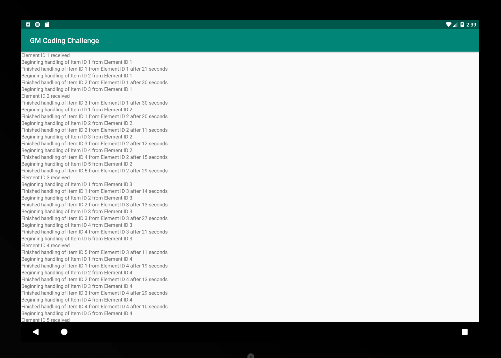

# GM Coding Challenge
## Option 1: Rx

### Fires an Element every 90 seconds with 5 Item children.  Processing the handling of items
### in a thread of its own while updating the UI on the main thread to update status.
### Added some basic unit tests.
### App APK in root of directory.

